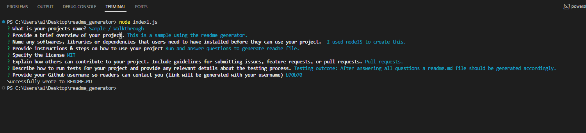
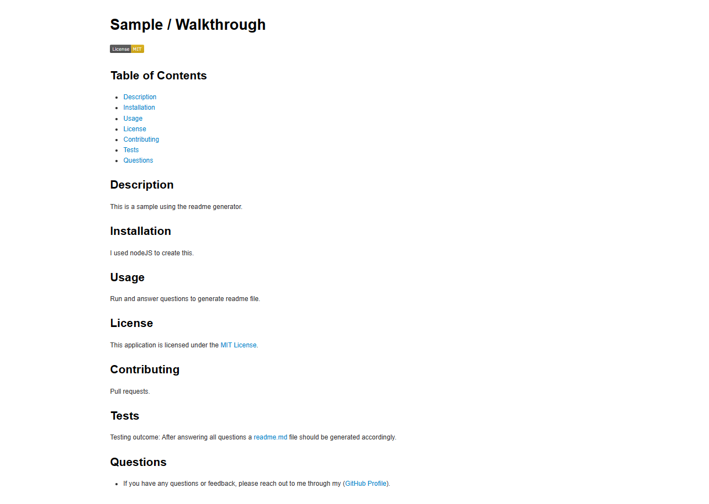

# README_Generator

I've developed a README generator which is created running this application, after the user's input, an md file will be created as the purpose for a README.md file. In this repo you will find a sample of a generated README file using this app.

In the process, an array of questions is employed, prompting input from the terminal when executing the "index1.js" file with the command 'node index1.js.'

The primary aim of this tool is to assist developers in crafting polished and efficient README files for their GitHub repositories. It accomplishes this through a command-line interface that dynamically produces professional README documents based on user input, leveraging the Inquirer npm package.

## Images

This image shows running the node index1.js file in the terminal.

Sample generated README file.

## Video walkthrough

 [Video Walkthrough](https://drive.google.com/file/d/1Xpz6ujv7q27ZvBAKFyxbdghV8KZJKKZ7/view)

This effort was carried out by Faheem.